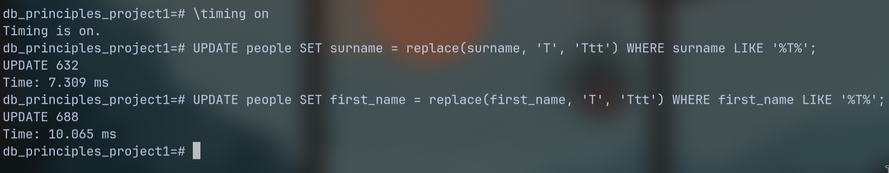
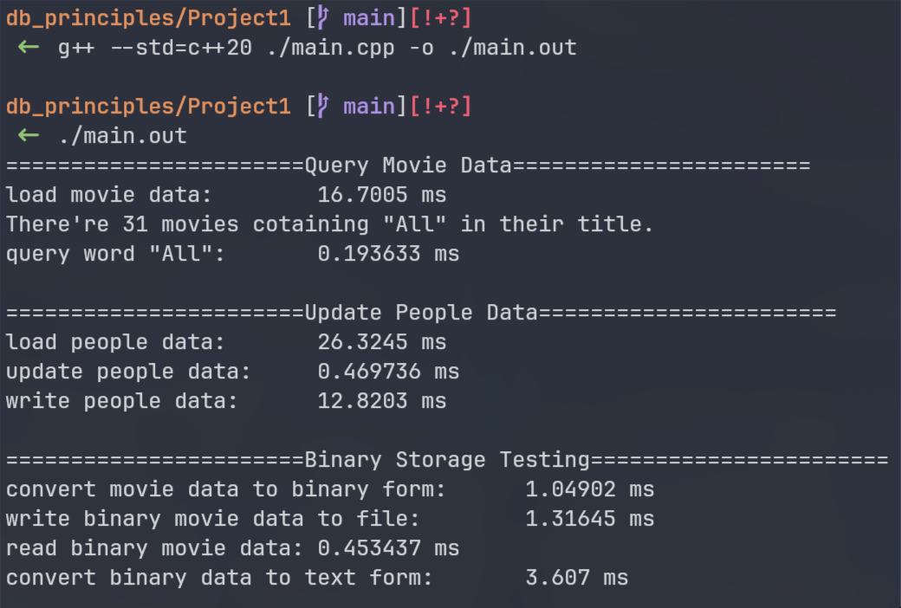
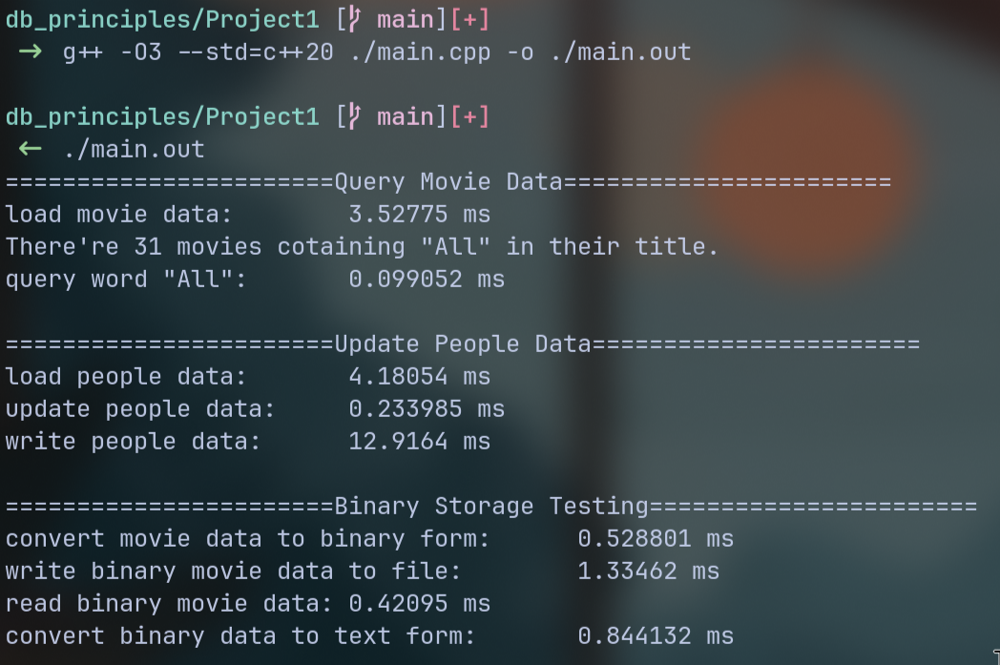
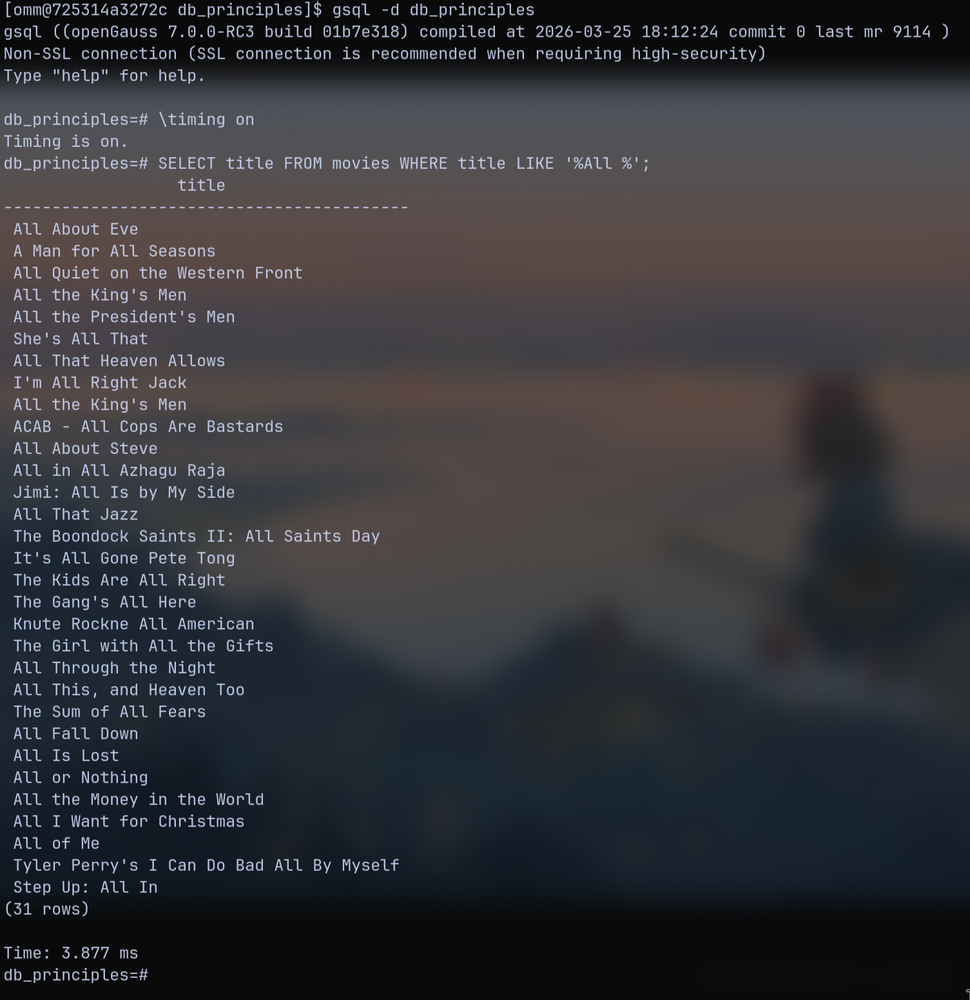
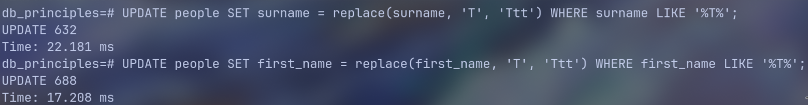

[_**github link**_](https://github.com/Xiaomony/Principles-of-Database-2026-Autumn-/tree/main/Project1)

# Compare DBMS with data operations in files

We can use `\timing on` command in `psql` to turn on the timer and record the runtime of each operations.

In the retrieval comparison and update comparison, we store data in the following file format:

```text
|column1|column2|column3|...
|column1|column2|column3|...
|column1|column2|column3|...
```

### Retrieval and Update Comparison

|                 PostgreSQL Retrieval                  |                   **Postgres Update**                   |
| :---------------------------------------------------: | :-----------------------------------------------------: |
|  |         |
|             **Our Execution Result(C++)**             |   **Our Execution Result(C++ with O3 Optimization)**    |
|       |  |

According to the screenshot, we have the following statistic data(in **millisecond**):

- Query Operation

    |          | Load Data from Files | Query Operation | Query Time(Sum) |
    | :------: | :------------------: | :-------------: | :-------------: |
    | Postgres |       unknown        |     unknown     |      2.977      |
    |   C++    |       16.7005        |    0.193633     |      16.89      |
    | C++(O3)  |       3.52775        |    0.099052     |      3.627      |

- Update Operation
    |          | Load Data from Files | Update Operation | Write Data to Files | Update Time(Sum) |
    | :------: | :------------------: | :--------------: | :-----------------: | :--------------: |
    | Postgres |       unknown        |     unknown      |       unknown       |      17.374      |
    |   C++    |       26.3245        |     0.469736     |       12.8203       |      39.615      |
    | C++(O3)  |       4.18054        |     0.233985     |       12.9164       |      17.331      |

We can see from the table that:

1. _**IO operation**_ takes the _**most**_ time in those operations.
2. _**O3 Optimization**_ provides a great improvement in IO performance and the runtime almost reaches that of the PostgreSQL.

### Optimize Storage

As _**IO operation**_ takes the _**most**_ time in the above operations, we can try to optimize the way we store data. A simple way is to store datas in binary form.

We store movie datas in the following format in the memory and directly write it to local files in binary form.

```cpp
struct Movie {
    size_t id;
    uint32_t release_year, runtime;
    size_t movie_name_len;
    char country_code[2], name[100]{};
};
```

Although the result has been presented before, we show it here again:

|              Our Execution Result               |               Our Execution Result(O3)                |
| :---------------------------------------------: | :---------------------------------------------------: |
|  |  |

|            | Write to Binary Files(ms) | Read from Binary Files(ms) |
| :--------: | :-----------------------: | :------------------------: |
| Without O3 |          1.31645          |          0.453437          |
|  With O3   |          1.33462          |          0.42095           |

From the statistic data, we can conclude that, binary storage greatly improved our IO performance, but `-O3` provides little improvement in binary IO operations.

And _**with a tailored data struct which has been known in compile time**_, our program is even much faster than PostgreSQL when we add up the IO operation time and query/update operation time.

# Compare PostgreSQL and openGauss

|                   openGauss Retrieval                   |                 openGauss Update                  |
| :-----------------------------------------------------: | :-----------------------------------------------: |
|  |  |

|            | Query Time(ms) | Update Time(ms) |
| :--------: | :------------: | :-------------: |
| PostgreSQL |     2.977      |     17.374      |
| openGauss  |     3.877      |     39.389      |

In our experiments, PostgreSQL outperformed openGauss in the time of both retrieval and update operations. _**However, as openGauss runs in the docker, we can't assert that Postgres performes much better than openGauss.**_

# Conclusion

- Without optimization, **PostgreSQL significantly outperformed** our C++ database simulation.

- With `-O3` optimization, the C++ simulation achieved execution times **comparable to PostgreSQL**.

- With **binary storage**, the C++ simulation achieved shorter query and update times. This improvement can be attributed to:

    - Eliminating UTF-8 text parsing and field-splitting overhead.
    - Copying binary data directly into memory, avoiding intermediate variables and unnecessary memory copies.
    - Compiler optimizations that may further improve the efficiency of these data-processing operations.

- openGauss took longer than PostgreSQL in both retrieval and update operations in our experiments. However, since openGauss ran inside **Docker**, environmental overhead may have affected the results. Therefore, we cannot conclude that openGauss is inherently slower.

- Overall, our experiments demonstrate that **storage format and compiler optimization can significantly affect performance**. Fair DBMS comparisons require **consistent and controlled testing environments**.
